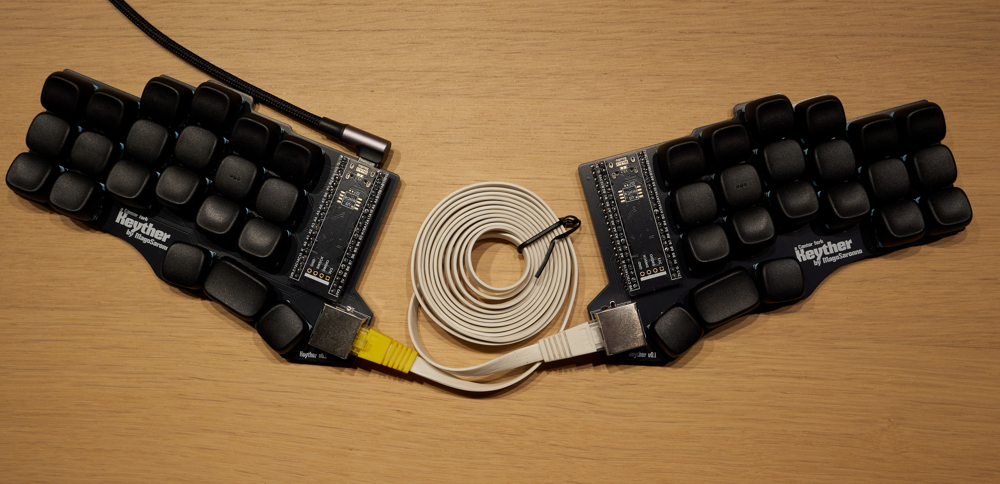

# Keyther Keyboard
The Keyther Keyboard represents an attempt at perfecting the already great [Cantor Classic](https://github.com/diepala/cantor "The original project").  The name comes from the combination of the substantives **Keyboard** and **Ethernet**, due to the use of an RJ45 socket. 

*Special thanks to both [diepala](https://github.com/diepala "The Cantor Keyboard creator") and [daprice](https://github.com/daprice "The creator of the footprints libraries") for having paved the way for the creation of the Keyther Keyboard.*

### What changes from Cantor

1. The TRRS socket is replaced with the more secure RJ45 (Ethernet) to avoid *critical* integrity issues caused by accidental disconnection or hot-plugging.  Indeed, the Keyther Keyboard supports hot-plugging, as shown in this video:
 
 
   

2. The design introduces **hot-swappable** Kailh Choc **sockets** and **handedness by pin** (through the addition of a 10k resistor and an added line in the config.h file)
You won't have to desolder all 42 switches to change them and you will be able to connect the keyboard even through the right half.

3. The horizontal space between switches has been *increased*, accommodating larger hands **without** additional modifications to the overall PCB size (expept the space for the RJ45 socket).

### What does not change

The keyther keyboard keeps (*for the most part*) the original concepts that were at the origin of Cantor, which are the diodeless design and the use of an invertible PCB design, to ultimately avoid cuttable costs.

### Why RJ45 instead of USB-C or magnetic pogo pin sockets?

The main reasons to use RJ45 sockets are their easy soldering, their overall diffusion, and the widespread presence of premade cables of different kinds, like coiled, straight, and flat.

Additionally, the number of pins present on the socket allows the possible addition of two optional communication lines between PCBs for whatever use (namely pins 1 and 5).

# Be Aware
The Keyther Keyboard is designed to be used with ***STRAIGHT-THROUGH CABLES***, not the crossover ones.

***Always check the cable type before connecting the two halves***.

## Disclaimer
All the designs and files are provided "AS IS" without any warranty or support.

## Links Index

[Ordering Guide](docs/Ordering_Guide.md)

[Assembly Guide](docs/Assembling_Guide.md)

[Firmware Guide](https://qmk.fm/guide "The default guide for the Cantor Keyboard")

## Quick Guide

### Bill of Materials (BOM)
The required components needed to assemble the keyboard are the following:
| N. | Item                                                                                                                                        | Notes                                                                  |
|----|---------------------------------------------------------------------------------------------------------------------------------------------|------------------------------------------------------------------------|
| 2  | PCB board                                                                                                                                   |                                                                        |
| 2  | STM32F401CC BlackPill microcontrollers                                                                                                      | *on [AliExpress](https://it.aliexpress.com/item/1005005953179540.html?)* |
| 4  | 20 pin stripes                                                                                                                              | *usually included with the Blackpill*                                  |
| 42 | Kailh Choc ***v1*** switches                                                                                                                | *namely the Kailh PG1350*                                                |
| 42 | Kailh Choc hot-swap sockets                                                                                                                 |                                                                        |
| 42 | Kailh Choc ***v1*** compatible keycaps                                                                                                      |                                                                        |
| 2  | RJ45 sockets (RJHSE type, e.g., the [RJHSE-XM80](https://docs.rs-online.com/b456/A700000007566767.pdf "The technical drawing of the socket"))| *on [AliExpress](https://it.aliexpress.com/item/1005007661898327.html?)* |
| 1  | Straight-through Ethernet cable                                                                                                             | *flat ones seem to be more flexible and less annoying when using the keyboard*     |
| 1  | USB-C cable compatible with your computer                                                                                                   |                                                                        |

### Ordering the PCB
To order the PCB, you will need the Gerber files present in the [Release section](https://github.com/MagoSaronno/keyther/releases). Then, you can either compare the prices on [PCBShopper](https://pcbshopper.com/ "A price comparison site for printed PCBs") by choosing a dimension of 150x90mm or upload them directly to the PCB manufacturer's website of choice.

You can refer to the [Ordering Tutorial](docs/Ordering_Guide.md) page which provides a step-by-step guide on the ordering procedure.

> I personally prototyped my PCBs using JLCPCB, primarily due to lower prices. However, these may vary depending on your customs policies and regional shipping rates.

### Firmware
> It is preferable to flash and check the microcontroller for defects before assembling the keyboard.

The Keyther Keyboard uses the [QMK Firmware](https://qmk.fm/), specifically the same as the Cantor Keyboard. You can easily follow the [guide](https://qmk.fm/guide "The default guide for the Cantor Keyboard") on the QMK website to *customise* and *compile* the firmware.

To add **language-specific characters** (such as *accented* or *umlaut* vowels) you can follow this [additional guide](Language-Specific_Keymap.md).

Unfortunately, at this time, to add the handedness feature to your keyboard you will need to use the [QMK source](https://docs.qmk.fm/newbs "The guide to use the source"), and, before compiling, add to the cantor's config.h file the line:

`#define SPLIT_HAND_PIN B12`

### Enter Bootloader Mode
To flash the firmware onto the microcontroller you will need to set it in bootloader mode first:
- Press and hold the BOOT0 button.
- Press and release the NRST button.
- Release the BOOT0 button.

Now you will be able to flash the firmware and check if the microcontroller works properly.

> Once the first flash has been done successfully you will be able to enter bootloader mode just by plugging in one half of the keyboard **while** holding down the top-left or top-right (*whether it is the left or right keyboard half*).

### Assemble the keyboard
To assemble your Keyther Keyboard you will need a soldering iron and tin of your choice. You can also follow the [Assembly Guide](docs/Assembling_Guide.md).

### Printing the Keyther cases
To 3D print the cases to protect the bottom of your keyboard halves you will need to download the *.stl* files present in the [case folder](https://github.com/MagoSaronno/keyther/tree/main/case) of this repository and slice them with the appropriate software.

In case you wish to modify the designs, you can download the *.step* files in the [step folder](https://github.com/MagoSaronno/keyther/tree/main/case/step).
I've personally succeded in printing them using generic PLA with a layer height of 0.2mm and no supports.

## Feedback
You can fill out [this form](https://forms.gle/tCP48DNiQqiqbWwy6 "Leave here your much appreciated feedback") to let me know of any potential improvements or issues with the project. 

### Have fun!
